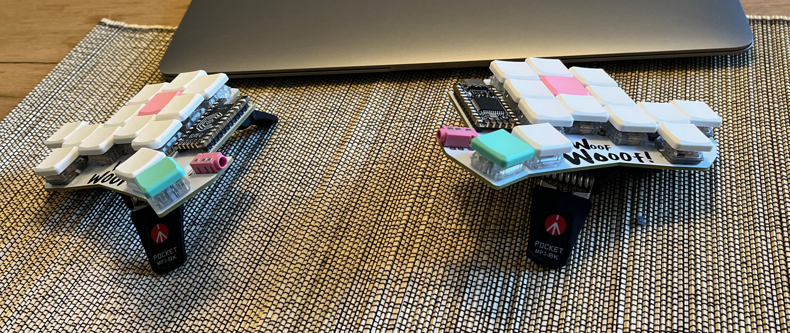
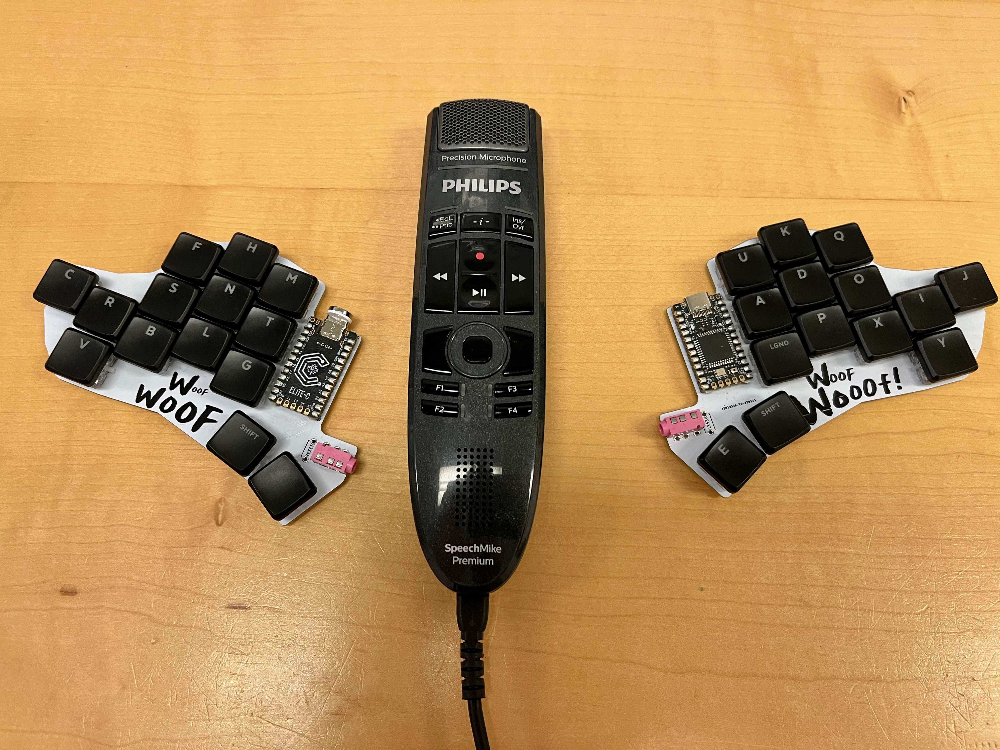

# Woof-28-key-split-keyboard

## Description

If you hate moving your entire hand to reach keys, this 28-key collumnar staggered keyboard is for you.

It lacks the inner index collumn, and the upper pinky key has been moved to an easier to reach position. 

## Photos:

## Design Inspiration:

I named it woof since it sort of looks like a dog's head.

The keyboard uses the same staggering and keyspacing as the Ferris keyboard, but the inner index collumns have been removed. 

The upper row pinky keys have been moved to a position thats easier to reach. This is inspired by the Osprette, although the upper pinky key positions aren't the same.

Links:
* [Ferris, 34-key choc spaced keyboard](https://github.com/pierrechevalier83/ferris)
* [Osprette, 34-key unibody keyboard with pinky clusters](https://github.com/smores56/osprette)

## How to Print the circuit board

1. Download the gerber.zip file
2. Send it to a PCB manufacturer of your choice.
3. Pay and wait in patience

## How to build it

### Hardware requirements

* the PCB uploaded here
* Choc switches
* Choc compatible keycaps
* MCU: any ProMicro based MCU
* Optional: Battery, TRRS switch, TRRS cable, reset switch, 

### How to install the firmware

Either:
1. Use QMK. see my keymap below
OR
2. Use ZMK and make your own shield. the ZMK keymap is yet to be made

## My keymap

[QMK keymap](https://github.com/mrkskk/qmk_firmware/tree/my_branch/keyboards/woof)

## License
It is fully Open-Sourced.
